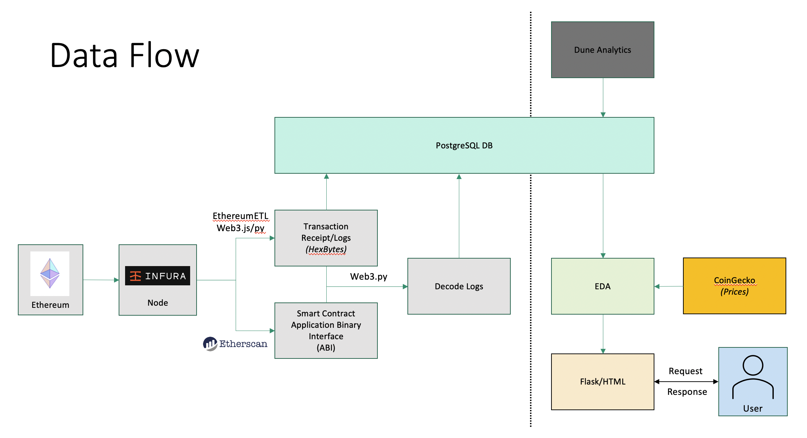
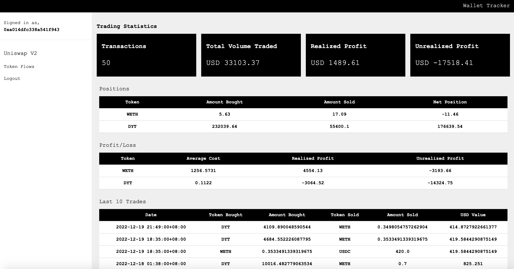

<h1>Ethereum Wallet Tracker</h1>

**<h2>Introduction</h2>**

As part of my capstone at General Assembly's Data Science Immersive course, I have decided to undertake a slightly different type of project. The 'Ethereum Wallet Tracker' provides an end to end flow of processing raw on-chain data from Ethereum into a dashboard to provide insights on UniswapV2 trades. 

**<h2>Files</h2>**

<h3>Decoding of On-chain Data</h3>

- *ethereumetl.sh* - EthereumETL to export transactions by block number
- *transction_receipt.js* - Asynchronous function to pull transaction receipts (using web3.js)
- *transactions.ipynb* - Decode transaction events (using transaction logs/events from transaction_receipt.js output)

<h3>EDA and Front-end Deployment</h3>

- *cgextras.py* - CoinGecko token lists (used to match and index prices)
- *pnl.py* - EDA for dashboard
- *tokenflows.py* - EDA for flows
- *app.py* - Deployment via Flask
- *dunesqlquery.sql* - SQL query used for sample data set (Dune Analyics)

<h3>PostgreSQL DB (via Python)</h3>

- *psycopg2query.py* - Custom psycopg2 functions to run SQL queries

**<h2>Process</h2>**

*<h3>1. Extracting Raw Data</h3>*

In order to extract raw on-chain data, we make use of Infura's API, which allows us to access Ethereum. A combination of EthereumETL and Web3 package were used to get the transaction data required. The current process makes use of asynchronous programming to concurrently make API calls for transaction receipts. However, a further optimization would be to use EthereumETL's implementation with Google Cloud Platform for more efficient extraction.

*<h3>2.1 Decoding</h3>*

The decoding functions are written in python and makes use of Web3.py. A huge shoutout to Yifei Huang, whos [articles](https://towardsdatascience.com/decoding-ethereum-smart-contract-data-eed513a65f76) have provided much insight into understanding on-chain data. This process involves matching the transaction event hashes with those in the smart contract ABI. The event ABI is then used to decode the hexadecimal strings into human readable format. One optimization included here was the use of LRU caches to avoid unncessary API calls for repeatedly used smart contract ABIs. Thereafter, the data is parsed to obtain the trade details for UniswapV2 swaps.

*<h3>2.2 Database</h3>*

The PostgreSQL database was set up locally and holds all transactions, receipt/logs and decoded data. 

*<h3>3. EDA</h3>*

The EDA portion of this project currently only covers several components and makes use of other datasets due to the lack of computational resources. Trade data from [Dune Analytics](https://dune.com/queries/1809554) (which resembles decoded data from the process above) was used to generate information on trade statistics (count, volume, profit/loss), token positions (long/short/net) and trade history (last 10 trades). 
 **PnL calculated based on average cost basis; Prices from CoinGecko* 

For this capstone submission, a sample set of 1m+ trades from UniswapV2 were used to generate the trade statistics. More protocols will be included in the future.

Another component is on token transfers (akin to Chainalysis/Elliptic). This tracks the amount of in/outbound transfers between wallets. Currently, I am only tracking a handful of tokens (USDC, USDT, BUSD, DAI, WETH, stETH, WBTC) and using Etherscan's API to do so. In the next ieration of this project, I intend to make use of the raw on-chain data to filter all transfer events based on the inputs and logs.
- For ETH transfers: input = []
- For ERC-20 transfers: methodId = '0xa9059cbb' OR event_hash = '0xddf252ad1be2c89b69c2b068fc378daa952ba7f163c4a11628f55a4df523b3ef'

Filtering by methodId/event_hash will allow me to capture all ERC-20 transfers, rather than manually maintaining a dictionary of ERC-20 token address that need to be passed through the Etherscan API

*<h3>4. Front-end Deployment</h3>*

This part of the project is something completely new to me. As I am enrolled in a Data Science course, front-end developement was a new experience for me. I decided to use Flask due to my familiarity with Python to deploy a simple webpage. While Flask is useful in teaching the basics of web development, I soon ran into issues due to the limitations with Python. My next steps would be to run as much of my code in node.js, where I also plan to build graph networks to display token flows using the vis.js package.

**<h2>Conclusion</h2>**

Despite learning mostly ML models throughout the course, this project was a great learning experience that introduced me to new programming concepts. The next steps of this project (post submission for my final course) will be to optimize data extraction/decoding and build more insights. Feel free to reach out to me on [LinkedIn](https://www.linkedin.com/in/eugene-khoo/) for any queries.